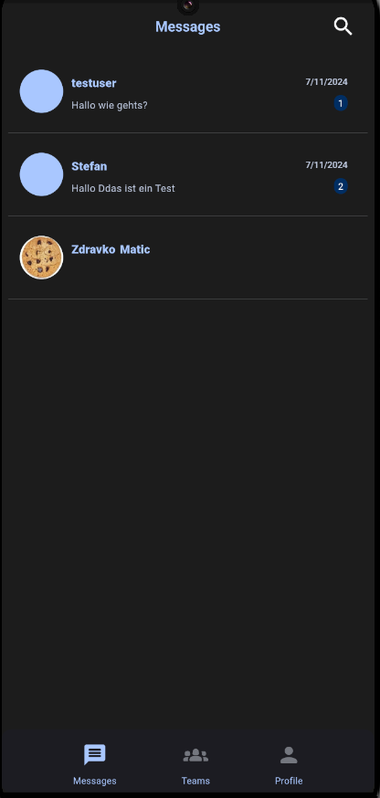
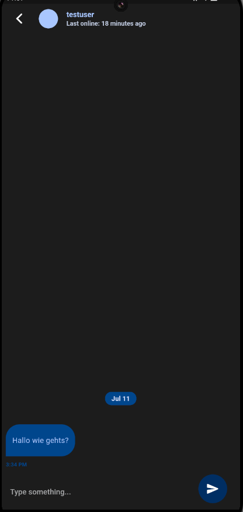
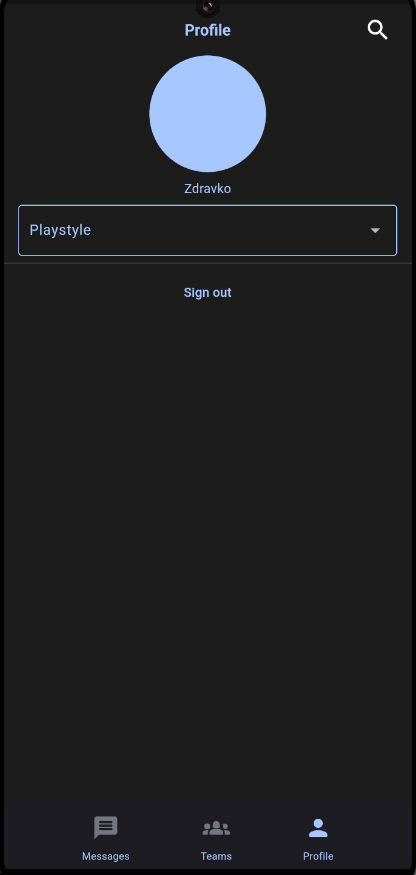
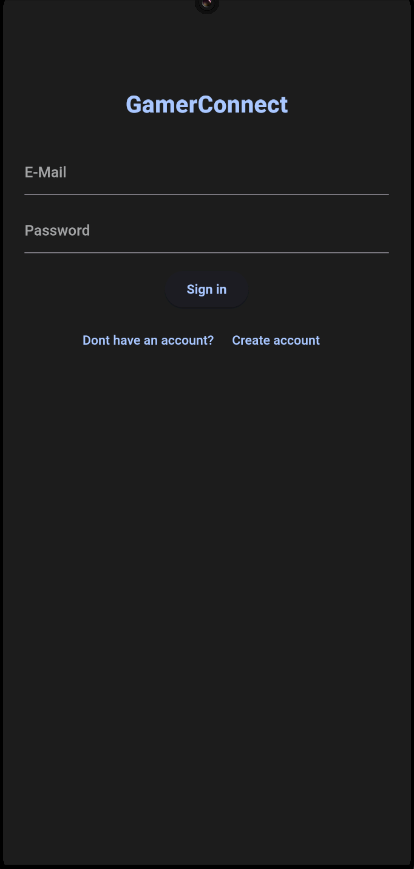
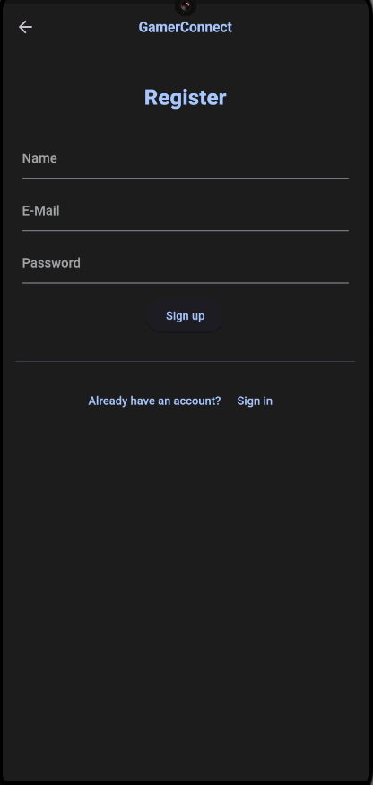

# GamerConnect

## Abstrake Beschreibung

GamerConnect ist eine innovative App, die es Gamern ermöglicht, sicher und anonym miteinander zu kommunizieren. Die App bietet eine benutzerfreundliche Plattform, auf der Nutzer unbesorgt chatten und sich mit anderen Gamern vernetzen können.

## Detaillierte Beschreibung

GamerConnect ist eine bahnbrechende App, die eine sichere und anonyme Kommunikationsplattform für Gamer bietet. Sie ermöglicht es Spielern, sich mühelos zu vernetzen und auszutauschen, ohne ihre Privatsphäre zu gefährden. Die benutzerfreundliche Oberfläche der App erleichtert das Chatten und den Aufbau von Verbindungen innerhalb der Gaming-Community. Nutzer können Diskussionen über ihre Lieblingsspiele führen, Strategien austauschen oder einfach neue Freundschaften knüpfen, während ihre Identität geschützt bleibt. Die App bietet verschiedene Kommunikationsoptionen wie Einzel- und (zukünftig) Gruppenchats, Sprachkanäle und die Möglichkeit, Gaming-Sessions zu planen. GamerConnect revolutioniert die Art und Weise, wie Gamer interagieren, indem es eine sichere, anonyme und engagierte Community schafft, in der Spieler unbeschwert kommunizieren und Verbindungen aufbauen können.

## gelöstes Problem

Das Ziel von GamerConnect ist es, Gamern eine Möglichkeit zu bieten sich untereinander zu vernetzen ohne private Daten preiszugeben. Durch die App haben die User die Möglichkeit sich mit einer E-Mail zu registrieren die nicht veröffentlicht wird und dadurch können Sie mit anderen Usern chatten und sich vernetzen.

## Zielgruppe

### Casual Gamer
- Möchte sich mit neuen Leuten vernetzen
- Möchte nicht unbedingt private Daten preisgeben

### Kompetitive Gamer
- Möchte Gamer mit gleichen Interessen finden
- Möchte Teams bilden und fordern

### Streamer
- Möchte sich mit seiner Community vernetzen

## vorhandene Screens und Funktionalitäten

### Message Page

- Übersicht der vorhandenen Chats und Nachrichten

### Chat Page

- Chatfenster mit Chatfunktion

### Profile Page

- Sicht des aktuellen Users mit Logout Funktion

### Sign In Page

- Login Fenster für bereits registrierte User

### Sign Up Page

- Registrierungsseite für neue User

## Zukünftige Ziele

- Teamsfunktion mit Gruppenchats
- Dark/Light Mode
